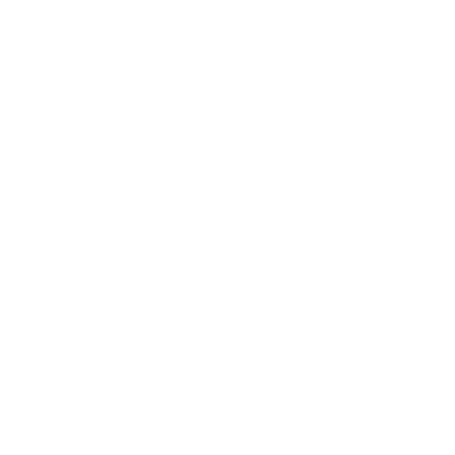

  
    
  
  &nbsp;
  
  &nbsp;
  

---

# Barb's Snatcher

A Roblox sound asset tool for downloading and reuploading audio from your games. Comes with a Windows installer, a built-in launcher that auto-updates, and a Roblox Studio plugin.

## Plugin

Install the plugin from the Roblox Creator Store: [BSNATCHER Plugin](https://create.roblox.com/store/asset/99679893270521/BSNATCHER-Plugin)

The plugin source file (`Barb's Snatcher - SOURCE.rbxmx`) is attached to the [latest release](https://github.com/barbecueIs/barbs-snatcher/releases/latest) if you want to host it yourself or inspect the code.

## Getting Started

1. Download and run the installer from the [latest release](https://github.com/barbecueIs/barbs-snatcher/releases/latest)
2. The launcher will guide you through installation
3. Open Settings and enter your `.ROBLOSECURITY` cookie and Open Cloud API key
4. Install the Studio plugin, open it in Roblox Studio, and it connects automatically on port 54321

## What You Need

- `.ROBLOSECURITY` cookie for CDN downloads
- Open Cloud API key with `asset:read` and `asset:write` permissions for reuploading
- The place IDs of the games you want to pull sounds from

## Notes

Currently supports:
audio
animation (CURRENTLY W.I.P, PLEASE USE OTHER ALTERNATIVES TILL FINISHED)
monetization (gamepasses, developer products)

Others may come later on in developement.

---

> **Versions v1.0.3 through v1.0.14 are internal development builds and were not intended for public use.**
> The first public release is **v1.0.15**. Those earlier releases are kept on GitHub for reference but are marked as pre-release.

## License

This project is licensed under the [GNU General Public License v3.0](LICENSE).

You are free to use, modify, and distribute this software. Any derivative work must remain open source under the same license. See the [LICENSE](LICENSE) file for the full terms.
